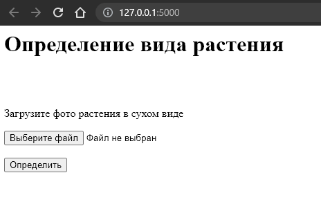
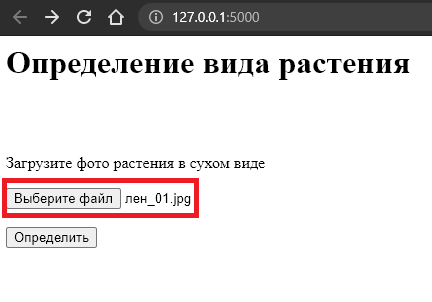
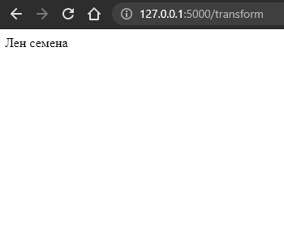

# LSML - 2 Финальный проект
Данный проект предназначен для определения наименование высушенного лекарственного растения по его изображению.

## Инструкции по запуску приложения:
- клонировать репозиторий командой `git clone https://github.com/andreykoz82/herbskls.git`
- перейти в папку проекта и выполнить команду `docker build . -t deploy_flask` для компиляции приложения
- запустить приложение командой `docker run -p 5000:5000 -t -i deploy_flask:latest`
- открыть веб браузер и перейти по адресу `http://127.0.0.1:5000/`

## Работа с приложением:
Для определения вида лекарственного растения, вам необходимо загрузить изображение, нажав кнопку `выберите файл`.
После загрузки изображения нажмите кнопку `определить` и программа выдаст результат распознования изображения.
Для поиска изображения в сети интернет, используйте шаблон запроса `<наименование растения> сушеное`, например `ромашка сушеная` или `мята сушеная`.
В папке `img` я сохранил несколько изображений, найденых в интернете, для тестирования работы приложения.

Главное окно приложения:

Загрузка файла для определения растения

Результат определения

## Описание работы:
- **Датасет**: Исходными данными для построение датасета являются изображения высушенных лекарственных растений, полученные в ходе приемки на предприятии от поставщиков.
Исходные изображения находятся в папке `raw_data` и разбиты в папки по годам. Название файла соответствует номеру аналитического листка на данный вид партии.
Привязка номера аналитического листка к наименованию сырья находится в `excel` файле `certificates\certificates_2018_2019.xlsx`. В данном файле содержится информация по
аналитическим листкам с 2018 по 2021 г.
Формирование датасета происходит по средством выполнения кода, расположенного в `scripts\create_dataset.py`. Скрипт создает папки с наименованием сырья и распределяет 
соответствующие изображения по данным папкам, также выполняется `train\test split`
- **Модель**: В качестве модели испольуется предтренированная сеть `ResNet`, в которой заменен последний линейный слой в соответствие с нужным количеством классов (71)
и выполнено обучение данного слоя по собственному датасету.
В качестве метрики используется `weighted accuracy` т.к. классы не сбалансированы. В качестве loss функции используется `CrossEntropyLoss`
Обучение модели находится в скрипте `scripts\train_model.py`, обученная модель сохранена в `models\resnext50_32x4d_gpu.pth`. 
Результаты обучения находятся в файле Jupyter Notebook `notebooks\herbs.ipynb`, достигнутая accuracy равна 0.84.
